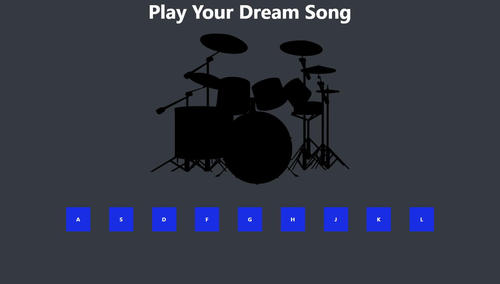

# 🥁 Drumkit Play Song

Bu proje, **JavaScript ile bir davul seti (drumkit) uygulamasıdır**. Kullanıcılar, ekrandaki butonlara tıklayarak veya klavyeden belirli harflere basarak farklı davul seslerini çalabilirler. 🎵  

## 🚀 Özellikler
- 🎹 **Klavye ile çalma**: Belirtilen harflere basarak sesleri çalabilirsiniz.
- 🖱️ **Butonlarla çalma**: Butonlara tıklayarak ses çıkartabilirsiniz.
- 🎨 **Dinamik efektler**: Butonlara basıldığında animasyon efekti eklenmiştir.
- 🔊 **Gerçek davul sesleri**: Her harfe özgü ses dosyaları ile gerçekçi bir deneyim sağlar.

## 📸 Ekran Görüntüsü

## 📂 Dosya Yapısı
/project-folder │── assets/ │ ├── css/ │ │ ├── styles.css │ ├── js/ │ │ ├── script.js │ ├── wav/ │ │ ├── boom.wav │ │ ├── clap.wav │ │ ├── hihat.wav │ │ ├── kick.wav │ │ ├── openhat.wav │ │ ├── ride.wav │ │ ├── snare.wav │ │ ├── tink.wav │ │ ├── tom.wav │── index.html │── README.md

## 🛠 Kullanılan Teknolojiler
- HTML5  
- CSS3 (Bootstrap 4.6)  
- JavaScript  
